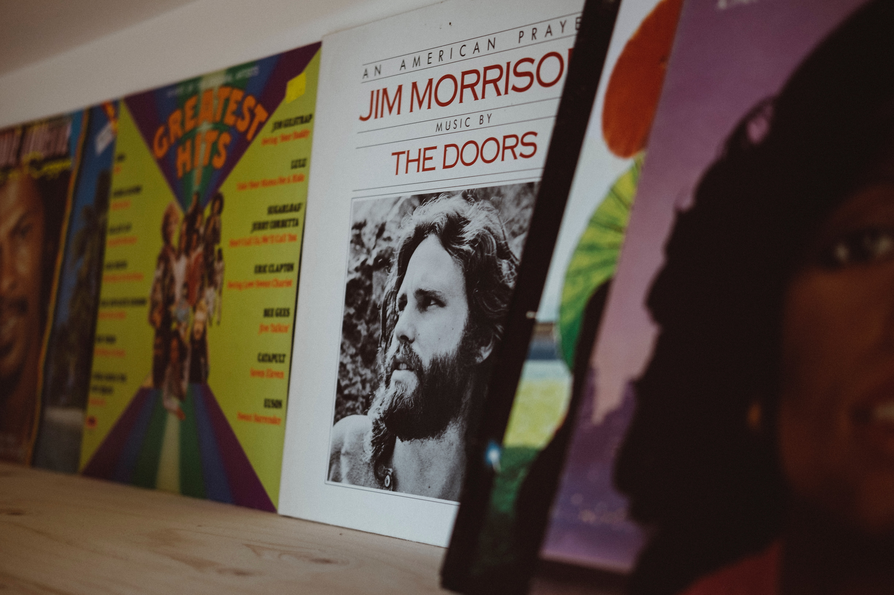

I was listening to some classic rock while learning about how to handle images in Gatsby, so I thought it was fairly appropriate that I include a photo, from Unsplash, depcting an album of The Doors as practice on how to use gatsby-remark-images.

Hurray it seems that the gatsby plugin works pretty well! Now to figure out more about image customization so that more interesting and useful additions can be made.
